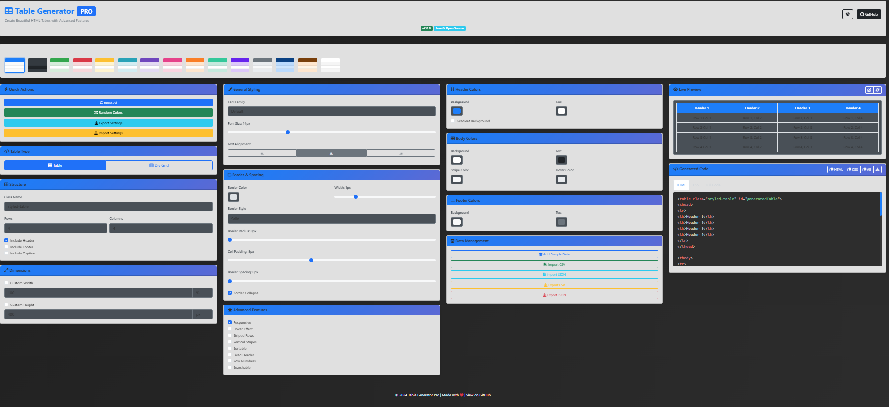

# 🎨 Advanced HTML Table Generator Pro

[](https://github.com/oathanrex/table-generator-pro)
[](LICENSE)
[](https://oathanrex.github.io/table-generator-pro/)

A powerful, professional HTML table generator with 15+ templates, live preview, advanced styling options, and comprehensive import/export features.



## ✨ Features

### 🎯 Core Features
- **15+ Pre-designed Templates** - Professional color schemes and styles
- **Dual Mode** - Generate HTML tables or DIV-based grid structures
- **Live Preview** - Real-time preview with inline editing
- **Advanced Styling** - Complete control over colors, borders, spacing, fonts
- **Responsive Design** - Mobile-friendly tables with responsive options
- **Dark Mode** - Built-in dark theme support

### 🛠️ Advanced Features
- **Import/Export Data** - Support for CSV and JSON formats
- **Sortable Columns** - Click headers to sort data
- **Search Functionality** - Built-in table search
- **Row Numbers** - Automatic row numbering option
- **Fixed Headers** - Sticky headers on scroll
- **Striped Rows** - Horizontal and vertical striping
- **Hover Effects** - Interactive row highlighting
- **Gradient Backgrounds** - Modern gradient effects
- **Border Radius** - Rounded corners support

### 💾 Data Management
- **Settings Export/Import** - Save and load your configurations
- **Sample Data** - Quick sample data generation
- **Edit Mode** - Inline content editing
- **Copy Code** - One-click code copying
- **Download Files** - Export complete HTML files

## 🚀 Quick Start

### Online Demo
Visit the live demo at [https://oathanrex.github.io/table-generator-pro/](https://oathanrex.github.io/table-generator-pro/)

### Local Installation
```bash
# Clone the repository
git clone https://github.com/oathanrex/table-generator-pro.git

# Navigate to directory
cd table-generator-pro

# Open in browser
open index.html

# Or use a local server
python -m http.server 8000
# Then open http://localhost:8000
